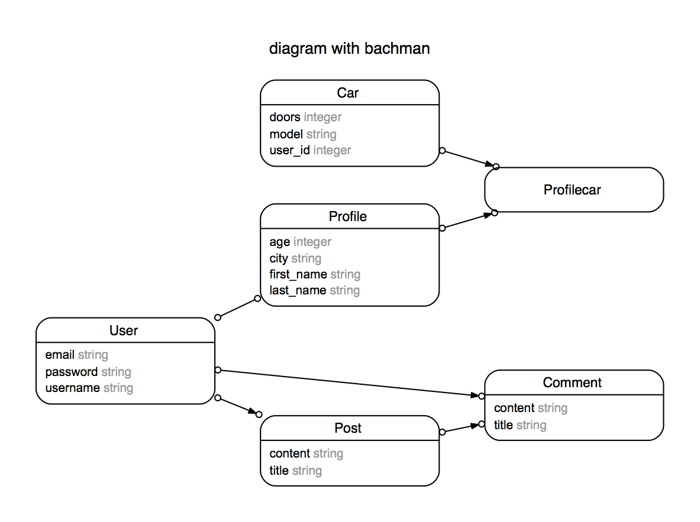

---
Sometimes, it's nice to get a great layout of your database, but you don't want to take the time to draw it all out by hand, whether on a computer or paper. Luckily, there's a very quick and easy way to this, and it's called Rails ERD.

###What is it?

Rails ERD is a gem, specifically [rails-erd](https://rubygems.org/gems/rails-erd/versions/1.4.5). What is does is it quickly creates an entity relationship diagram from your already constructed database, like the simple example below:

Now you can easily see the relationships between your tables.

###A quick guide to reading the diagram:

* A single arrow indicates a one to many relationship
* Double arrowed lines indicate a many to many relationship
* If the association is through a join table, the solid lines point to the join table, and the dashed lines show the indirect relationship
* Single table inheritance are displayed by gray tables
* Polymorphic associations are also displayed as gray
* Open/closed circles can indicate whether the relationship is mandatory or optional
* Some of these need to be enabled, which will be covered

###How to install

Installation is relatively straightforward. First you need Graphviz which constructs the diagram. Typically we could just `brew install` but the latest version of Graphviz does not work with the latest version of Mac OS (Mountain Lion and later). So head on over to [graphviz](http://graphviz.org/Download_macos.php) and grab the __2.36__ version (*not the latest version!*). Go ahead and install this the 'normal' way.

Next we need to add the gem to our Rails project. Go ahead and add `gem 'rails-erd'` to your Gemfile, and `bundle install`. Be sure not to confuse `gem rails-erd` with `gem erd`, as they are two different gems. After this is done, if you haven't already, be sure to have some sort of database set up with tables and relationships between those tables.

Finally, you are going to type `rake erd` in the command line, and it should display that it is creating the pdf. Once it is done, take a look in your Rails project, and at the top most level, there should be a `erd.pdf` file. That is your diagram!

Now there are many attributes you can turn on or off to customize the diagram, for example you could give it a title:
`rake erd title="My ERD Diagram"` and the title will appear in the pdf. Please note, each time you run `rake erd`, the erd file is overwritten. I recommend reading through the documentation found [here](http://rails-erd.rubyforge.org/customise.html) for more attributes to play around with.

Lastly, you can also configure attributes in a YAML file, located at  `~/.erdconfig`, which is a folder you would have to create. I ran into a bit of trouble attempting this, and since I keep my diagram relatively simple anyway, I decided not to bother. Also, the readme on the gem's [Github page](https://github.com/voormedia/rails-erd) is worth a look too.

I hope this was a helpful guide to getting Rails-ERD setup for your future projects. I can imagine that it would be quite useful as a way to introduce someone to a project's database, especially as it becomes more complicated.

[Github](https://github.com/richardmable/railsERDDemo)

